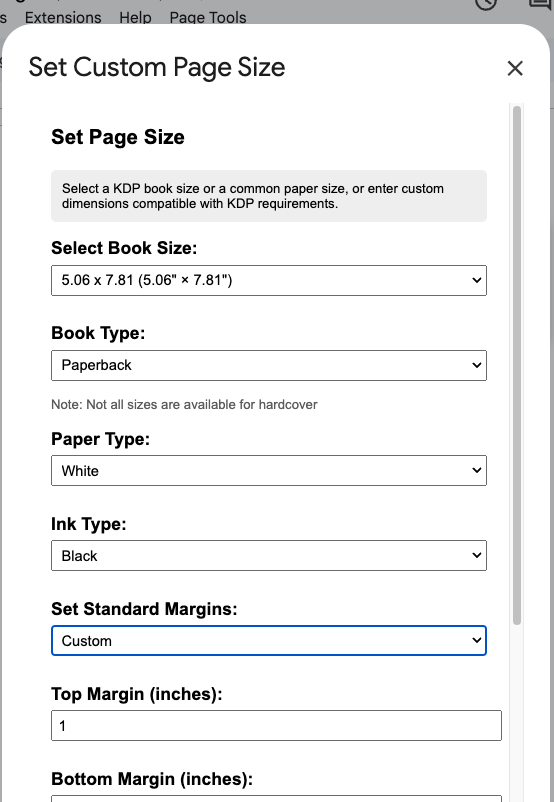

# Custom Page Size for Google Docs (with KDP presets)
A Google Apps Script tool that lets you easily set custom page sizes in Google Docs, with built-in presets for Kindle Direct Publishing (KDP) and other common paper formats.

## Features
- Set exact page dimensions with decimal precision
- Built-in KDP presets for both paperback and hardcover books
- Common paper sizes (Letter, Legal, A4, etc.)
- Custom dimensions support
- Paper type selection (white or cream)
- Ink type selection (black, premium color, standard color)
- Pre-defined margin templates (default, narrow, wide, mirrored for binding)
- Custom margin controls
- Visual preview with paper color
- Convenient custom menu integration

## Installation
1. Open your Google Document.
2. Click on **Extensions → Apps Script**.
3. Delete any code in the editor.
4. Copy and paste the entire code from `custom-page-size.js` into the editor.
5. Save the project (give it a name like "Custom Page Size").
6. Refresh your Google Doc.
7. When prompted with the Google permissions popup:
   - Click **Review Permissions**.
   - In the popup, click **Advanced**.
   - Click **Go to Custom Page Size (unsafe)** to allow the unverified script.
   - Grant the necessary permissions to run the script.
8. Look for the new "Page Tools" menu at the top of your document.

## Usage
1. Click on the **Page Tools** menu that appears in your Google Docs menu bar
2. Select **Set Custom Page Size**
3. Choose from the following options:
   - KDP Paperback sizes (5×8, 6×9, etc.)
   - KDP Hardcover sizes (6×9, 8.5×11, etc.)
   - Common paper sizes (Letter, A4, etc.)
   - Or select "Custom" to enter precise dimensions
4. Configure additional settings:
   - Book type (paperback or hardcover)
   - Paper color (white or cream)
   - Ink type (black, premium color, or standard color)
   - Margins (default, narrow, wide, mirrored, or custom)
5. Click "Apply" to format your document

## Use Cases
- Format manuscripts for KDP publishing
- Create documents with non-standard page sizes
- Set up proper margins for book printing
- Visualize how your document will look on different paper types
- Prepare documents for various print requirements

## Support This Project
If you find this tool helpful for your projects, please consider:
- Giving it a star on GitHub
- Sharing it with others
- [Buy me a coffee to support this project!](https://ko-fi.com/animal__) As a self employed writer, everything helps :)

## License
This project is licensed under GPLv3.

## Disclaimer
This tool is not affiliated with or endorsed by Google or Amazon KDP. All trademarks belong to their respective owners. Page size specifications are based on published guidelines as of March 2025.
